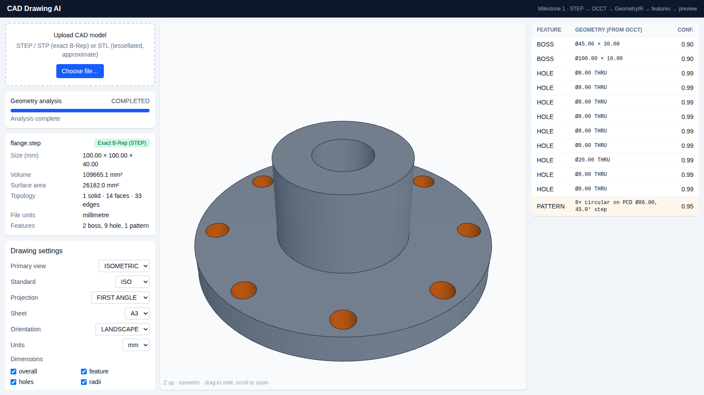

# CAD Drawing AI

Turns STEP/STP and STL models into professional engineering drawings
(SLDDRW, DWG, PDF, DXF). Geometry comes from a deterministic engine (OCCT),
drawings from SolidWorks, and the LLM (DeepSeek-V4-Pro via Hugging Face
`transformers`) only *plans*.
It never measures, and it never invents dimensions, tolerances or
manufacturing data.

> **Status: milestone 1 of 10.** Working today: STEP/STL upload → OCCT
> analysis in an isolated subprocess → GeometryIR → feature recognition → REST
> API → 3D preview with feature highlighting. Drawing planning, compilation,
> SolidWorks generation, export and QA are **not implemented yet**. Their
> endpoints return `501` instead of fake results. See [docs/ROADMAP.md](docs/ROADMAP.md).



## What works (tested)

| Capability | Notes |
|---|---|
| STEP import (AP203/214/242 geometry) | units converted to mm (mm/m/inch verified), BRepCheck validity |
| STL import (binary + ASCII) | bbox, area, volume/centroid if watertight; all values flagged *inferred* |
| Properties | bounding box, volume, surface area, centroid, principal axes, symmetry-plane candidates |
| Topology | solids/shells/faces/edges/vertices with adjacency and edge convexity |
| Features (STEP) | holes (through/blind, counterbore, countersink), bosses/external Ø, slots, pockets, fillets/rounds, planar & conical chamfers, circular/rectangular/linear hole patterns |
| Stable IDs | content-hash IDs for faces/edges/features, identical across re-analysis |
| API | upload (validated, size-limited, sniffed), async analysis jobs with progress, GeometryIR, preview mesh |
| UI | upload, progress, geometry summary, feature table, Three.js preview (isometric default), drawing-settings panel (defaults: ISO, first angle, A3 landscape, mm) |

## Quick start

```bash
uv sync --all-packages                                  # Python 3.12+ workspace
uv run pytest                                           # 100+ tests incl. end-to-end
uv run uvicorn cad_api.main:create_app --factory --reload   # API :8000
cd apps/frontend && npm install && npm run dev          # UI  :5173
```
Test models: `examples/models/*.step` (regenerate with `uv run python scripts/generate_fixtures.py`).

Docker: `cp .env.example .env` (set `POSTGRES_PASSWORD`), then `docker compose up --build`.
The UI is on :8080.

## Repository layout

```
apps/api                 FastAPI (cad_api)            apps/frontend   React+TS+Vite+Tailwind+Three.js
apps/solidworks-worker   Windows worker (contract only, milestone 6)
services/geometry        OCCT pipeline (geometry_service)  services/drawing-{planner,compiler,qa}  stubs
packages/geometry-schema GeometryIR   packages/drawing-schema DrawingPlan   packages/shared-types
infrastructure/          Dockerfiles, compose support      tests/  geometry, schemas, api, integration, meta
examples/                models, reference drawings, GeometryIR, plans   references/  official-source index
.claude/skills/          5 Claude skills               CLAUDE.md  project instructions
```

## Documentation

[Architecture](docs/ARCHITECTURE.md) · [API](docs/API.md) · [Development](docs/DEVELOPMENT.md) ·
[Geometry](docs/GEOMETRY.md) · [Drawing engine](docs/DRAWING_ENGINE.md) · [QA](docs/QA.md) ·
[SolidWorks setup](docs/SOLIDWORKS_SETUP.md) · [Deployment](docs/DEPLOYMENT.md) ·
[Third-party licences](docs/THIRD_PARTY.md) · [Roadmap](docs/ROADMAP.md)

## Engineering rules

Never invent geometry, dimensions, material, tolerances, GD&T, datums, finish,
treatment, inspection or process data. A CAD model yields a **geometry drawing**.
A **manufacturing drawing** requires information supplied by the user. Mock
SolidWorks output is always labelled `MOCK`.

## Licence

See [LICENSE](LICENSE) and [docs/THIRD_PARTY.md](docs/THIRD_PARTY.md).
